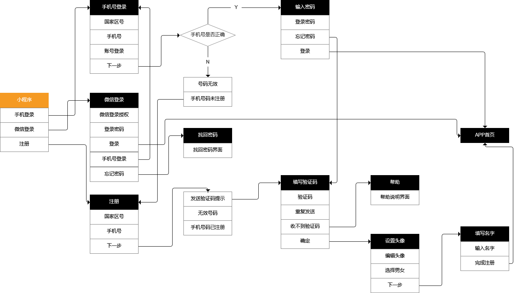

[TOC]

# FISTPRODUCT

## 材料
腾讯云服务器
zimg
## 产品概述
### 项目背景
**第一个产品的输出，不求十全十美，只求能将设想的产品能够输出**
### 项目目标及意义
**让每一位研究生更好愉快的科研，更光明的职业前景。**

### 产品名称
**BeSuccessful**

||小程序| Web|
|---|---   | --- |
| 功能 | 1. 发布研究问题；2. 寻求科研合作帮助；3. 不同研究方向的社群交流; 4. 论文修改及润色;5. 研究生活吐槽；6. 线下轰趴交流会 |产品的详细介绍和推介|
|作用|用于直接给用户使用|用于产品介绍和公司简介，以寻求未来合作|
### 版本
#### 小程序
|修改时间|版本|更新人员|描述|备注|
|---|---|----|-----|-----|
|2021-03-22|v0.01|安相静|项目初始化||

#### Web
|修改时间|版本|更新人员|描述|备注|
|---|---|----|-----|-----|
|2021-03-22|v0.01|安相静|项目初始化||

### 思维导图

### 业务流程图

## 功能说明
BeSuccessful主要是为了解决在硕博研究生扩招之后，越来越多的科研人员在学习和工作过程中科研压力大、科研迷茫、科研项目进展不顺利等问题；
注意：该项目不是为了给用户当抢手，而是通过我们的平台让用户可以发布项目，寻求学生科研项目的合作。并为用户提供社群交流的服务和一定的科研支持和引导。
### 功能清单
|小程序功能点|描述|解决问题|
| --- |---|---|
|注册/登录|当用户进入小程序首先出来注册登录界面|获取用户登录信息|
|微信授权|获取用户必要权限|主要获取用户位置、存储、通讯等权限|
|主页|展示科研热门动态，成功项目案例|主页直接让用户感受到产品的定位|
|课题SOS|发布用户自己的项目，以寻求合作|用于发布用户急需合作的项目|
|前辈Help|有一定项目经验的同学或者前辈接单去寻求帮助的同学合作完成项目|解决项目问题|
|配对|带有一定社交属性的人可以配对交流各自项目内容|用户社群服务产生依赖|
|线下交流会|以轰趴的形式，从不同的科研主题出发，组织线下课题交流，使用户得到更好的体验|线上线下结合，增强用户粘性|
|年度会议日历|将本年度所有知名的学术会议列入日历中|方便用户根据自己需求投稿|

### 注册/登录功能

## 界面原型图

### 注册/登录页面

### 首页

### 项目SoS页面

### 年度会议日历界面
### 配对页面

### 科研轰趴页面

## 用例说明
*编写业务用例，即按照真实的用户业务划分用例，记录人机交互过程，完成用例描述*

### 科研求助用户

### 科研帮用户

### 普通用户
## 商业价值

